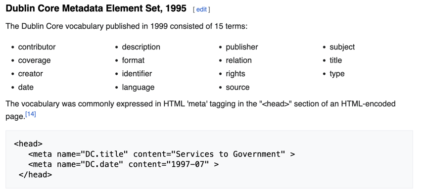

# DummyWeb

# Task description:
1.  Create a simple python dummy web server (e.g. Django) in which metadata on research data (such as data provider, data format, degree of aggregation) can be entered via three web form fields. 
2. Create a Plugin using pluggy that expands the functionality of the web server to download a README.txt, containing the entered metadata in the Dublin Core schema (HTML) from the webserver. 
3. Please document all steps in detail.

# Solution:
## Step1: know what is Dublin Core Metadata

## Step2: know how to use pluggy by running two examples
A [toy](https://pluggy.readthedocs.io/en/stable/) example is enough 

## Step3: 
## Create a Django Project
`django-admin startproject research_metadata` 

`cd research_metadata` 

`python manage.py startapp metadata` 

## make migrations
`python manage.py makemigrations`

`python manage.py migrate`

## Run the Server
`python manage.py runserver`
